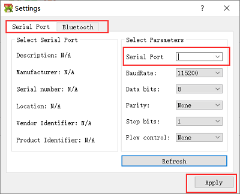
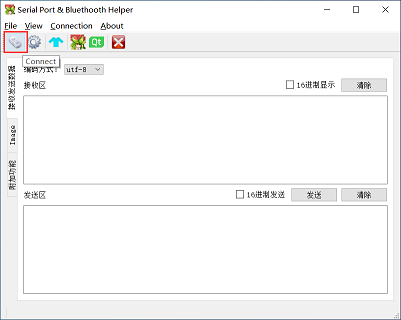

# SerialPort-Bluetooth-Helper

--- 
> 作者：侯宇轩  北京理工大学智能车俱乐部 BITSCC

> [代码地址](https://github.com/IronSublimate/serialport-bluetooth-helper)  
---

## 注意 
Qt Classic Bluetooth 只能在UWP,Android,Linux,macOS 平台使用，Windows 10 version 1507 以上系统可用  
详见[Qt Bluetooth](https://doc.qt.io/qt-5/qtbluetooth-index.html)

## 使用说明

### 连接方法
1. 配置   
  
2. 选择蓝牙或串口并配置   
   
3. 连接  


### 波形模式使用

点击下面的开始按钮波形开始显示，停止按钮波形停止  
左键拖动移动，右键画矩形框选择区域放大，滚轮缩放


### 其他
1. 接收发送数据为普通的串口功能
2. 查看图像可以查看单片机发送的未解压图像(二值化图像，1像素占1位)，
或解压后图像(灰度图像，1像素占8位)，使用键盘P键暂停，
点击保存图像按钮将图像保存在./output目录下
3. 附加功能的数据传输格式如下


## 数据传输格式
#### 附加功能

传送的格式统一为字符串，上位机向下位机发送以奇数开始，下位机向上位机发送以偶数开始；以'\\0'结束

- 参数模式
    - 下位机向上位机发送以0xa0开始，格式为  
	"\\xa0\[参数名\]\:\[参数值\]\\n\[参数位置\]:\[参数值(整数)\]\\n...\\0"  
	```c
	//send example
	putchar(0xa0);
	printf("speed0-2:%d %d %d",speed[0],speed[1],speed[2]);
	putchar(0x00);
	```

- 波形模式
    - 下位机向上位机发送以0xa8开始，格式为  
	"\\xa8\[参数名\]\:\[参数值(浮点数)\]\\n\[参数位置\]:\[参数值(整数)\]\\n...\\0"
	```c
	//send example
	putchar(0xa8);
	printf("speed0:%d\nspeed1:%d\nspeed2:%d\n",speed[0],speed[1],speed[2]);
	putchar(0x00);
	```

- 改参数模式
    - 上位机向下位机发送以0xb1开始，格式为  
	"\\xb0\[参数位置\]:\[参数值(整数)\]"  
    成功后下位机向上位机发送  
	0xb0\[参数值(整数)\]
    - 读取所有参数上位机向下位机发送0xb3，成功后下位机向上位机发送  
	0xb2\[参数名\]:\[参数位置(地址)\],\[参数值(整数)\]\\n\[参数名\]:\[参数位置(整数)\],\[参数值(整数)\]\\n...\\0
     
- 按键控制模式  
	当按键按下时发送控制指令，当按键松开时发送停止指令，当关闭手动控制时发送切回找灯指令  
	速度最大值为10000   
    - 上位机向下位机发送以0xc1开始,格式为  
	"\\xc1\[控制码\] \[速度\]\\x00"
	```c
	//receive example
	//This program send "\xc12 5000\0"
	char buffer[32];
	char* p = buffer;
	int control_code,speed;
	while(getchar()!=0xc1);
	while(1){
		*p = getchar();
		if(*p == 0x00){
			break;
		}
		++p;
	}
	sscanf(buffer,"%d %d",&control_code,&speed);
	```
    - 控制码对应：0停车，2后退，4左行，6右行，8前行，7顺时针转，9逆时针转，1切回找灯模式

- 摇杆控制模式   
	速度最大值为10000   
    - 上位机向下位机发送以0xc3开始,格式为  
	"\\xc3\[x方向向量(-1.0f\~+1.0f)\] \[y方向向量(-1.0f\~+1.0f)\] \[速度\]\\x00"
	```c
	//receive example
	//This program send "\xc30.8 -0.2 4000\0"
	char buffer[32];
	char* p = buffer;
	int speed;
	float x,y;
	while(getchar()!=0xc3);
	while(1){
		*p = getchar();
		if(*p == 0x00){
			break;
		}
		++p;
	}
	sscanf(buffer,"%f %f %d",&x,&y,&speed);
	```
	
#### 图像模式
单片机发送图像前必须先发送0x01 0xfe，表示图像的开始


## 开发环境及工具
1. Qt 5.12.4
2. QCustomPlot 2.0.1
